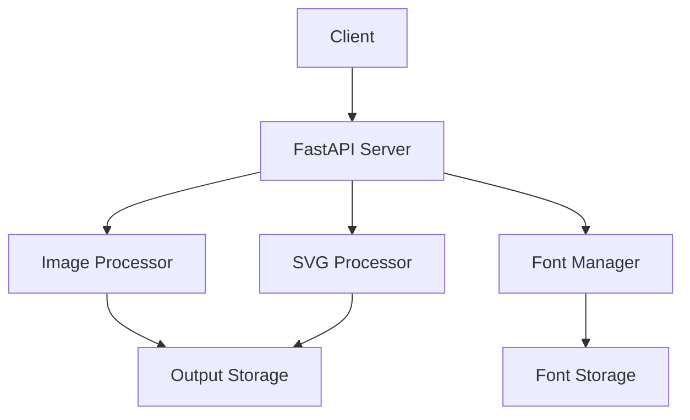

# Architecture Documentation

This document provides an overview of the TextSnap API architecture, its components, and their interactions.

## System Overview



## Core Components

### 1. FastAPI Server (`app/main.py`)

**Purpose**: Handles HTTP requests and routes them to appropriate endpoints.

**Responsibilities**:
- Request validation
- Response formatting
- Error handling
- Rate limiting
- CORS management

**Key Features**:
- Async request handling
- Automatic OpenAPI documentation
- Middleware support
- Dependency injection

### 2. Image Processor (`app/services/image_processor.py`)

**Purpose**: Processes images and applies text overlays.

**Responsibilities**:
- Image downloading
- Background removal
- Watermark removal
- Text rendering
- Image format conversion

**Key Features**:
- Async image processing
- Memory-efficient operations
- Support for multiple formats
- Error recovery

### 3. Font Manager (`app/services/font_manager.py`)

**Purpose**: Manages font loading and caching.

**Responsibilities**:
- Font discovery
- Font loading
- Font caching
- System font fallback

**Key Features**:
- Cross-platform font support
- Font caching for performance
- Automatic font fallback
- Font validation

### 4. SVG Processor (`app/services/svg_processor.py`)

**Purpose**: Processes SVG elements on images.

**Responsibilities**:
- SVG parsing
- SVG rendering
- Path optimization
- Style application

**Key Features**:
- SVG path support
- Style customization
- Performance optimization
- Error handling

## Data Flow

1. **Request Handling**
   ```mermaid
   sequenceDiagram
       Client->>FastAPI: POST /generate
       FastAPI->>ImageProcessor: Process request
       ImageProcessor->>FontManager: Get font
       ImageProcessor->>SVGProcessor: Process SVG
       ImageProcessor->>FastAPI: Return result
       FastAPI->>Client: Return response
   ```

2. **Font Management**
   ```mermaid
   sequenceDiagram
       Client->>FastAPI: GET /fonts/list
       FastAPI->>FontManager: List fonts
       FontManager->>FastAPI: Return font list
       FastAPI->>Client: Return response
   ```

## Directory Structure

```
textsnap-api/
├── app/
│   ├── api/
│   │   └── v1/
│   │       ├── endpoints/
│   │       │   ├── generate.py
│   │       │   ├── fonts.py
│   │       │   └── admin.py
│   │       └── router.py
│   ├── core/
│   │   └── config.py
│   ├── models/
│   │   └── request.py
│   ├── services/
│   │   ├── image_processor.py
│   │   ├── font_manager.py
│   │   └── svg_processor.py
│   └── main.py
├── assets/
│   └── fonts/
├── output/
├── cache/
├── logs/
├── tests/
├── docs/
└── requirements.txt
```

## Component Details

### API Endpoints

1. **Generate Endpoint**
   - Path: `/api/v1/generate`
   - Method: POST
   - Purpose: Process images with text and SVG

2. **Fonts Endpoint**
   - Path: `/api/v1/fonts`
   - Methods: GET, POST, DELETE
   - Purpose: Manage font files

3. **Admin Endpoint**
   - Path: `/api/v1/admin`
   - Methods: GET, POST
   - Purpose: System management

### Services

1. **ImageProcessor**
   ```python
   class ImageProcessor:
       async def process_image(self, request: GenerateRequest) -> str:
           # Process image and return path
   ```

2. **FontManager**
   ```python
   class FontManager:
       async def get_font(self, font_family: str, ...) -> ImageFont:
           # Get or load font
   ```

3. **SVGProcessor**
   ```python
   class SVGProcessor:
       async def process_svg(self, image: Image, svg_items: List[SVGItem]) -> Image:
           # Process SVG elements
   ```

## Performance Considerations

1. **Caching**
   - Font caching
   - Image result caching
   - System font caching

2. **Memory Management**
   - Stream processing
   - Resource cleanup
   - Error recovery

3. **Concurrency**
   - Async operations
   - Rate limiting
   - Resource pooling

## Security

1. **Input Validation**
   - Image size limits
   - Format validation
   - Path traversal prevention

2. **Rate Limiting**
   - IP-based limiting
   - Request throttling
   - Error handling

3. **Resource Management**
   - File permissions
   - Temporary file cleanup
   - Error logging

## Scalability

1. **Horizontal Scaling**
   - Stateless design
   - Shared storage
   - Load balancing

2. **Vertical Scaling**
   - Resource optimization
   - Caching strategies
   - Memory management

## Monitoring

1. **Logging**
   - Request logging
   - Error tracking
   - Performance metrics

2. **Metrics**
   - Response times
   - Error rates
   - Resource usage

## Next Steps

- Read the [API Documentation](api.md)
- Check the [Testing Guide](testing.md)
- Learn about [Development](development.md) 